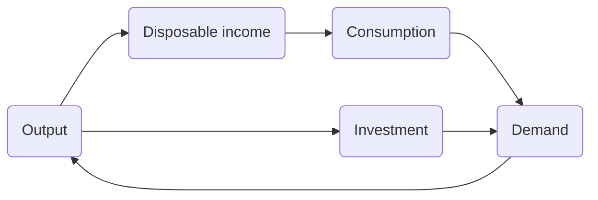
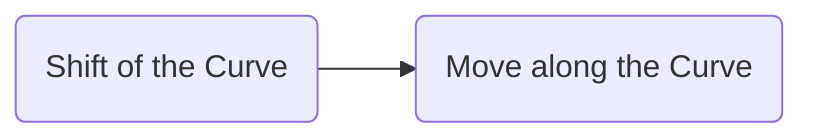
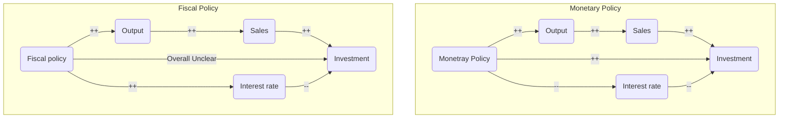

# The IS-LM Model
IS-LM: a framework to analyze both markets at the same time to define the **“grand equilibrium”**

- Goods market $\rightarrow Y$
- Financial market $\rightarrow i$
- short run
## Financial Markets and LM Relation
### From Nominal to Real
The **income** in the [[Ch4 - Financial Markets#The Demand for Money|equation]] $M=\$YL(i)$ is the **[[Ch1&2 - Overview#Nominal and Real GDP|nominal income]]**. Thus, dividing both sides by [[Ch1&2 - Overview#The GDP Deflator|price level]] (GDP deflator or CPI) $P$ gives

$$\text{real }M^{S}=\text{real }M^d$$

$$\frac{M}{P}=YL(i)$$

This is referred as the $LM$ Relation, where everything is assumed to be *real* instead of *nominal.*

>[!tip]
>we convert everything from *nominal* into *real* to keep consistent with the goods market

- $\frac{M}{P}$ is exogenous
- $Y$ and $i$ are endogenous
	- not every pair will make $LHS=RHS$

### $LM$ Curve
Given a fixed money supply, 

- Income increases $\rightarrow$ interest rate increases
	- LM curve is upward sloping
	- the effect of increased income is offset by the the increased interest rate.

![[Pasted image 20251014000614.png]]

Changes in output $\rightarrow$ moves along the LM curve

- each point on the LM curve is an equilibrium in the money market
- change output (income) $\rightarrow$ new equilibrium interest rate

### Shifts of the $LM$ Curve
Generally, any factor **(nominal money supply/price level)** that, for a given income, changes the **(real) money supply/demand** shifts the $LM$ curve

![[Pasted image 20251209224024.png]]

|Change|Effect on LM Curve|Reason|
|---|---|---|
|↑ Money supply|Shift right/down|Interest rates must fall to induce people to hold the larger money supply.|
|↓ Money supply|Shift left/up|Interest rates must rise to reduce demand to match the smaller supply.|
|↑ Money demand|Shift left/up|Interest rates must rise to equilibrate the increased demand for money.|
|↓ Money demand|Shift right/down|Interest rates must fall to equilibrate the decreased demand for money.|

## The Goods Market and the $IS$ Relation
### Determining Investment
Investment was no longer considered exogenous as in [[Ch3 - The Goods Market#Investment (I)|Chapter 3]]. Rather, investment depends on

- Sales: 
	- Output $\uparrow$ $\to$  investment $\uparrow$
- Interest Rate: 
	-  interest Rate $\uparrow$ $\to$ borrowing cost $\uparrow$ $\to$ investment $\downarrow$
	- still holds if not borrowing: the opportunity cost of lending profits

$$I=I\underset{(+,-)}{(Y,i)}$$

### Determining Output
We further abandon the linear assumption for [[Ch3 - The Goods Market#Consumption (C)|Consumption]], and thus the condition for equilibrium becomes

$$Y=C(Y-T)+I(Y,i)+G$$

which is the expanded [[Ch3 - The Goods Market#IS Relation|IS Relation]].

Given a fixed interest rate $i$,

![[Pasted image 20251013223030.png]]

The empirical evidence suggests that, when output increases, the sum of the increase in consumption and the increase in investment does not exceed the initial increase in output.

Thus, $ZZ$ is flatter than the 45-degree line.

### $IS$ Curve
An increase in the interest rate decreases the demand for goods at every level of output **(through investment)**. To reach the equilibrium, the output also decreases.

The relation between the interest rate and output is represented by the $IS$ curve.

![[Pasted image 20251013223658.png]]

### Shifts of the $IS$ Curve
Generally, any factor (e.g., $T$, $G$) that, for a given interest rate, decreases equilibrium output shifts the $IS$ curve left.

![[Pasted image 20251013233703.png]]

## The $IS$-$LM$ Model
| |Equilibrium| Effect|
|---|---|---|
|$IS$|supply of goods $=$ demand for goods | interest rate $\to$ output|
|$LM$|supply of money $=$ demand for money| income $\to$ interest rate|

$$\text{Output}\iff \text{Income}$$

$IS$ relation:

$$Y=C(Y-T)+I(Y,i)+G$$

$LM$ relation:

$$\frac{M}{P}=YL(i)$$

![[Pasted image 20251014004141.png]]

### Fiscal Policy
- Fiscal contraction (consolidation): decrease in the deficit ($G-T$)
- Fiscal expansion: increase in the deficit ($G-T$)
#### Tax Raise Example
1. How it affects equilibrium in the goods market ($IS$ curve)
	- Tax $\uparrow$ $\to$ Income $\downarrow$ $\to$ Consumption $\downarrow$ $\to$ Output $\downarrow$
	![[Pasted image 20251014010534.png]]

2. How it affects equilibrium in the financial market ($LM$ curve)
	- No shift
	![[Pasted image 20251014010743.png]]

3. Put $IS$ curve and $LM$ curve together
	- Income $\downarrow$ $\to$ Demand for money $\downarrow$ $\to$ Interest rate $\downarrow$ $\to$ Output $\uparrow$
	![[Pasted image 20251014010835.png]]

The decline in the interest rate reduces but does not completely offset the effect of higher taxes on the demand for good (final output equilibrium).

### Monetary Policy
- Monetary contraction/tightening: a decrease in the money supply
- Monetary expansion: an increase in the money supply
#### Monetary Expansion Example
Nominal money supply $\uparrow$ real money supply $\uparrow$  interest rate $\downarrow$ investment $\uparrow$ Output $\uparrow$

![[Pasted image 20251014021109.png]]

### Summary
#### Factors of Move
|  | Move along the curve | Shift of the curve|
|---|---|---|
|$IS$| interest rate | demand for goods |
|$LM$| Income (Output) | real money supply |
|Variable Type| [[Ch3 - The Goods Market#Investment (I)\|Exogenous]]| [[Ch3 - The Goods Market#Investment (I)\|Endogenous]]|

#### Policy Behind
|  | Move along the curve | Shift of the curve|
|---|---|---|
|$IS$| monetary | fiscal |
|$LM$| fiscal | monetary |

#### Sequence of Policy Effects

### Effects on Investment

## Policy Mix
Monetary-fiscal policy mix
### Same Direction
![[Pasted image 20251014162050.png]]
### Opposite Direction
Fiscal contraction to reduce the budget deficit; Monetary expansion to avoid recession.

## Introducing Time Dimension
Confidence band

## Appendix
### Interest Rate Rule
![[Pasted image 20251014185021.png]]

Instead of fixing the money supply, central banks in reality keep a constant interest rate or allow slight increase in case of increased money demand.
  