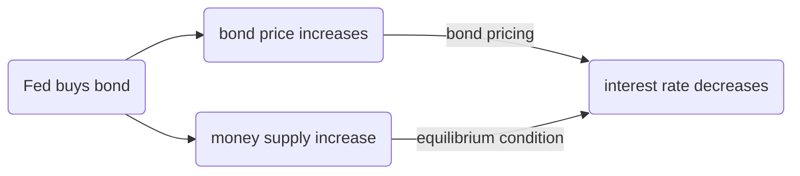

# Financial Markets
## The Demand for Money
$$
M^d=\$Y\underset{(-)}{L(i)}
$$

where $\$Y$ denotes nominal income. 

![[attachments/Pasted image 20251008220636.png]]

Money

- Checkable deposits
	- supplied by banks
- Currency
	- supplied by central banks

Suppose the central bank decides to supply an amount of money equal to $M$, i.e.,

$$M^s=M$$

The equilibrium condition is

$$M=\$YL(i)$$

which is called **LM relation**, **L** stands for **liquidity**.

Interest rate $i$ must be such that people are willing to hold an amount of money equal to the existing money supply $M$ given their income $\$Y$

![[attachments/Pasted image 20251008221754.png]]

![[attachments/Pasted image 20251008221859.png]]

## Determining the Interest Rate I
only central bank
### Monetary Policy
#### Open market operation
expansionary open market operation

- buy bond
	- money supply increases

contractionary open market operation

- sell bond
	- money supply decreases

## Determining the Interest Rate II
Introduce checkable deposits issued by private banks.

![[attachments/Pasted image 20251008223537.png]]

$$\text{Reserve Ratio}=\frac{\text{Reserve}}{\text{Checkable deposits}}$$

### Demand for Money
- $c$ : fixed proportion of people's money in currency
- $CU^d$ : demand for currency
- $D^d$ : demand for checkable deposits

$$CU^d=cM^d$$

$$D^d=(1-c)M^d$$

### Demand for Reserves
$\theta$ : Reserve Ratio

$$R=\theta D$$

Demand for reserves is given by

$$R^d=\theta(1-c)M^d$$

### Demand for Central Bank Money
$H^d$ : demand for central bank money

$$
\begin{align}
H^d&=CU^d+R^d \\
&=cM^d+\theta(1-c)M^d \\
&=[c+\theta(1-c)]M^d
\end{align}
$$

Given that $M^{d=}\$YL(i)$

$$H^d=[c+\theta(1-c)]\,\$YL(i)$$

### Determination of the Interest Rate
$H$ as the supply of central bank money is directly controlled by central bank

$$H=H^d=[c+\theta(1-c)]\,\$YL(i)$$

Given that $0<c<1$

$$H^d<M^d$$

i.e., the demand for central bank money is less than the demand for overall money

![[attachments/Pasted image 20251008224218.png]]
