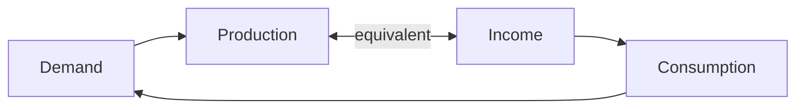
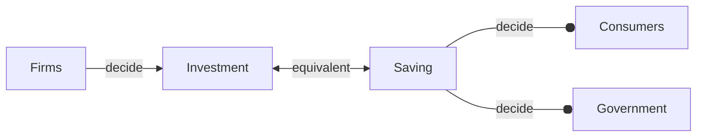

# The Goods Market
## The Composition of GDP
GDP

- Consumption (C)
	- goods and services purchased by consumers
- Investment (I) (aka fixed investment)
	- Non-residential
		- purchase by firms of new plants or machines
	- Residential
		- purchases by people of new houses
- Government spending (G)
	- purchases of goods and services by the gov
	- gov transfers are not included
		- Medical or Social Security payment
		- Interest payment on the gov debt
- Net exports (trade balance)
	- ($+$) Exports (X)
	- ($-$) Imports (IM)
- Inventory investment
	- Production - Sales

---

- trade surplus: $X>IM$ 
- trade deficit: $X<IM$ 
## The Demand for Goods
The decomposition reveals the source of demand.
$Z$: Total demand for **domestic** goods

$$Z\equiv C+I+G+X-IM$$

which is an [[Ch3 - The Goods Market#Types of Equation|identity]]

- This is the definition of $Z$
- inventory investment is **not** included
### Assumption
- Only **one good** economy
- Supply any amount at a given price
	- Perfectly elastic supply
	- only valid in short run
	- no inflation concerns
	- focus only on the demand
- Closed economy
	- $X=IM=0$

---

$$Z\equiv C+I+G$$
### Consumption (C)
$C$ can be represented by a consumption function

$$C=\underset{(+)}{C(Y_{D})}$$

which is a [[Ch3 - The Goods Market#Types of Equation|behavioral equation]]
To be more specific and simpler, we further assume the function to be linear

$$C=c_{0}+c_{1}Y_{D}$$

The relation between consumption and disposable income is then characterized by two parameters, $c_{0}$ and $c_{1}$:

- $c_{1}$: the (marginal) propensity to consume
	- the effect an additional dollar of disposable income has on consumption
	- $0<c_{1}<1$
		- people tend to consume only part of increased disposable income
- $c_{0}$:
	- in extreme case ($Y_{D}\to 0$)
		- people need to eat even without income (by dissave)
	- in most cases
		- changes in $c_{0}$ reflect changes in consumption for a given level of disposable income
			- e.g., due to changes in interest rate, optimistic about the future

$Y_{D}$: disposable income
$Y$: Income
$T$: Tax minus gov transfers

$$Y_{D}\equiv\text{Income}-(\text{Tax}-\text{Gov Transfers})=Y-T$$
### Investment (I)
- Endogenous variable
	- depends on other variables in the model
	- explained within the model
	- e.g., [[Ch3 - The Goods Market#Consumption (C)|consumption]]
- Exogenous
	- taken as given
	- not explained within the model
	- e.g. [[Ch3 - The Goods Market#Investment (I)|investment]]

We assume investment to be exogenous for simplicity here

$$I=\bar{I}$$

### Government Spending (G)
$T$ and $G$ describe **fiscal policy**, i.e., the choice of taxes and gov's spending.

We also assume $G$ and $T$ exogenous but with different reason from that of investment

- gov behave differently as consumers or firms
	- but not unpredictable
- one of the tasks of macroecon is to explore the implication of fiscal policy
- no need to use $\bar{T}$ and $\bar{G}$ since T and G are almost always exogenous
## The Determination of Equilibrium Output
$$Z\equiv c_{0}+c_{1}(Y-T)+\bar{I}+G$$
Assume no inventory investment, **equilibrium in the goods market** requires that production be equal to the demand for goods:

$$Y=Z=C+I+G$$

which is an [[Ch3 - The Goods Market#Types of Equation|equilibrium equation]].

Further we have

$$Y=c_{0}+c_{1}(Y-T)+\bar{I}+G$$

- In equilibrium, *production* $Y$ (the left side) equals *demand*, which in turn depends on *income* $Y$ (the right side) that itself equals *production*
### Algebra
Rewrite the equilibrium equation gives

$$Y=\frac{1}{1-c_{1}}(c_{0}+\bar{I}+G-c_{1}T)$$
> $(c_{0}+\bar{I}+G-c_{1}T)$: autonomous spending

- $c_{0}>0$
- $\bar{I}>0$
- $G-c_{1}T=(G-T)+T(1-c_{1})$
	- $1-c_{1}>0$
- positive for most of the time
- negative only when *Taxes* $T$ is much larger than *Gov Spending* $G$
	- i.e. a very large budge surplus

> $\frac{1}{1-c_{1}}$: multiplier

- $\frac{1}{1-c_{1}}>1$
- Effects of changes in each term in autonomous spending will be magnified by multiplier

### Graph
![[attachments/Pasted image 20250919151840.png]]
![[attachments/Pasted image 20250919153705.png]]

### Words
One unit change in demand will trigger a chain reaction

Demand increases $\to$ Production increases $\to$ Income increases $\to$ Consumption increases $\to$ Demand increases

 
 which can be expressed by a geometric series

$$1+c_{1}+c_{1}^2+c_{1}^3+\dots=\frac{1}{1-c_{1}}$$

The end result is an increase in output that is larger than the initial shift in demand, by a factor equal to the multiplier.

The size of the multiplier depends on the value of the propensity (tendency) to consume.

## IS Relation
There is an alternative view on the equilibrium from investment and saving.

$$\text{Saving}=\text{Private Saving}+\text{Public Saving}$$

Private saving $S$ equals customers' disposable income minus consumption

$$S=Y-T-C$$

Public saving $S'$ equals taxes (net of transfer) minus government spending

$$S'=T-G$$

Subtract taxes ($T$) from both sides of [[Ch3 - The Goods Market#The Determination of Equilibrium Output|previous equilibrium equation]]

$$Y-T-C=I+G-T$$

Or equivalently

$$I=(Y-T-C)+(T-G)=S+S'$$

> Therefore, the equilibrium in the goods market requires that investment equal saving (sum of private and public), which is called **IS relation**

The private saving can be written as

$$
\begin{align}
S&=Y-T-C \\
&=Y-T-c_{0}-c_{1}(Y-T) \\
&=-c_{0}+(1-c_{1})(Y-T)
\end{align}
$$

The parameter $(1-c_{1})$ is called the propensity to save.

Also,

$$I=-c_{0}+(1-c_{1})(Y-T)+(T-G)$$

We get the exact same result as before

$$Y=\frac{1}{1-c_{1}}(c_{0}+\bar{I}+G-c_{1}T)$$
## Appendix
### Ex-Post vs. Ex-Ante
- Ex-Post (After the fact):
	- It is a measured fact that $GDP=Z$
	- they are the same thing in a ex-post view
- Ex-Ante (Before the fact, Planned)
	- In economic models, **planned aggregate demand** $Z$ and **planned output** $GDP$ might not be equal given inventory investments
### Types of Equation
- Identities
- Behavioral equations
- Equilibrium conditions
### Macroeconomists' Tools
1. Algebra
	- make sure the logic is correct
2. Graphs
	- build the intuition
3. Words
	- explain the results