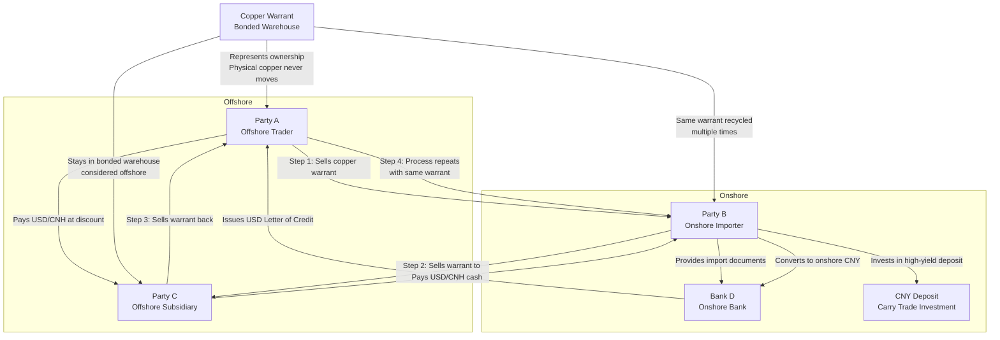

# Forwards and Futures on Currencies
## Types of Currencies
- World's dominant currency: USD
	- large proportion of the reserves of central banks
	- predominantly used for international trade
	- safe-heaven
	- no necessarily risk-free
- Major reserve currency: EUR, JPY, GBP, CHF (Swiss franc)
	- can move against USD
- Commodity currency: AUD, CAD, NZD
	- countries depend heavily on the export of raw material
- Pegged currency: HKD
	- (almost) fixed exchange rate against USD

## Exchange Rate Quotes
XXX/YYY: how much of the quote currency (YYY) is needed to buy one unit of the base currency (XXX)

## Currency Forward to Hedge FX Risk
A U.S. fund invest \$1 million in government bonds for one year, ether in Hong Kong or in London

While HKD/USD is fixed, GBP/USD is expected to increase to $S_{T}^{GBP}=1.658$ or decrease to $S_{T}^{GBP}=1.20$ with equal probability.

To hedge the risk of **GBP depreciation** (decreasing GBP/USD), the fund can **short** GBP forwards.

The short side will sell GBP at maturity by receiving the forward price of $F_{0,T}=\$1.429$ for each $\textsterling 1$

![[Pasted image 20250927012058.png]]

## Forward Exchange Rate
The pre-agreed exchange rate for a currency pair, i.e., the "forward price" (in quote currency) the long side need to pay to buy the "underlying" (base currency).

Assume the quote currency is USD. The continuously-compounded US interest rate is $r$, and the foreign rate is $r*$.

Since $r*$ is the interest rate of the underlying (base currency), it can be viewed as the [[L3 - Forwards and Futures on Commodities#Yield on Forward Price|dividend yield]] generated from holding base currency.

$$F_{0,T}=S_{0}e^{(r-r*)T}$$

$S_{0}$ is the spot exchange rate
$F_{0,T}$ is the forward exchange rate

## Covered Interest Rate Parity (CIP)
When the forward rate is $F_{0,T}=S_{0}e^{(r-r*)T}$, there is no arbitrage opportunity. This is called the CIP condition.

![[Pasted image 20250927021018.png]]

CIP can fail during financial crisis where investors cannot borrow dollars as they want since investors prefer one currency over the others.

In this case, it implies that the preferred currency (normally US dollar) has additional "convenience yield".

Generally, arbitrage can fail due to

- lack of borrowing capacity
- funding risk
- fear of withdrawals

## Uncovered Interest Rate Parity (UIP)
>[!Core Idea]
>
>- the difference in interest rates between two countries should be equal to the expected change in their exchange rate over the same period.
>- In other words, If you earn a higher interest rate in one country, you should expect to lose that extra gain due to your currency depreciating when you convert it back.
>- It's a "no-arbitrage" condition, meaning it assumes that potential profits from investing in higher-yielding currencies are eliminated by expected currency movements.

Assume $F_{0,T}=E_{0}[S_{T}]$, when CIP holds (for the most of the time as shown in data),

$$E_{0}[S_{T}]=S_{0}e^{(r-r^*)T}$$

If $r<r^*$, then $S_{0}>E_{0}[S_{T}]$, i.e., the exchange rate is expected to decrease. It implies that **the lower-interest rate currency is expected to appreciate**

>[!Question] Verification
> Run regression on historic data $$\ln S_{t+1}-\ln S_{t}=\alpha+\beta(r_{t}-r_{t}^*)T+\epsilon_{t+1}$$ If UIP holds, the estimate of $\beta$ should be equal to 1.

## Currency Carry Trade
Borrow in low-rate currencies and lend/invest in high-rate currencies.

- gain from interest rate difference
- additional gain from appreciation of the low-rate currencies if UIP holds

The standard way to do carry trade is with forwards.

- long euro against USD by US investors $\iff$ short USD against euro by European investors
- Long EUR/USD forward  $\iff$ Borrow in US and Invest in European

## Case Study: Chinese Copper Carries
