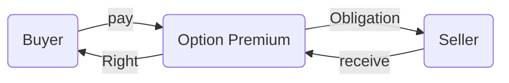

# Options

> [!NOTE] Definition
> A option gives its holder the right, but not the obligation, to buy or sell a given asset (the underlying) for a pre-specified price (the strike price) at a pre-specified date (the maturity date). The right to buy is a call option, the right to sell is a put option.

European Options: the buyer can **only** exercise the option ==at== the maturity date
American Options: the buyer can **only** exercise the option ==at or before== the maturity date



## Option Payoff
Let today be t = 0, T is the maturity date, ST is the underlying price at T, K is the strike price

For call option buyers,

- If $S_{T}<K$
	- do not exercise
	- Payoff $=0$
- If $S_{T}>K$
	- exercise the option
	- Payoff $=S_{T}-K$

$$\text{Payoff of a call}=\max(S_{T}-K,0)$$

In general,

|     |Call     |Put|
| --- | --- | --- |
|Long     |$\max(S_{T}-K,0)$     |$\max(K-S_{T},0)$|
|Short|$\min(K-S_{T},0)$|$\min(S_{T}-K,0)$

### Profit
The sellers of options receive premium, while the buyers pay it.

The profit graph shifts up (down) the payoff graph by the premium for sellers (buyers)

![[Pasted image 20251027153611.png]]

### Call Option Moneyness

- Out of the Money (OTM)
	- $S_{t}<K$
	- get nothing from exercising at $t$
- In the Money (ITM)
	- $S_{t}>K$
- At the Money
	- $S_{t}=K$

## Put-Call Parity
The payoff of a portfolio of long put and short call with the same strike $K$ and maturity $T$ is

$$\max(K-S_{T},0)-\max(S_{T}-K,0)=K-S_{T}$$

which is equivalent to the payoff of a short forward with $F'_{0,T}=K$.

If we further long a forward at $F_{0,T}$, we have at $T$

$$K-S_{T}+(S_{T}-F_{0,T})=K-F_{0,T}$$

which is a riskless (known at $t=0$) payoff with present value

$$e^{-r\times T}(K-F_{0,T})=e^{-r\times T}-S_{0}$$

By no-arbitrage, the price difference between put and call today is

$$\text{Put}_{0}-\text{Call}_{0}=e^{-r\times T}-S_{0}$$

This equation link together put and call options, stock, and bonds, implying that we can create any of these four instruments using the other three. If not, there is an arbitrage opportunity.

```mermaid
flowchart LR
1(long a put)-->2(portfolio)
3(short a call)-->2
4()
```