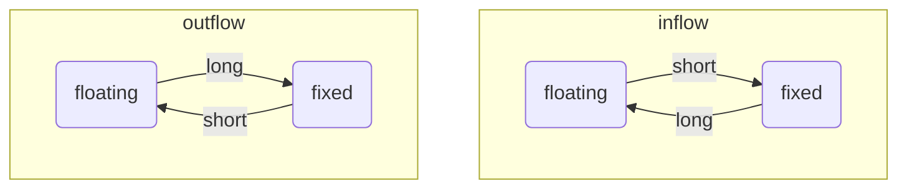
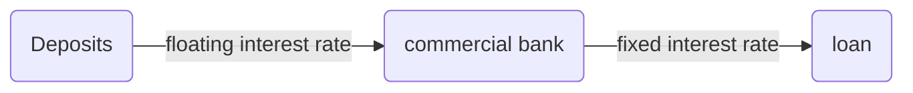
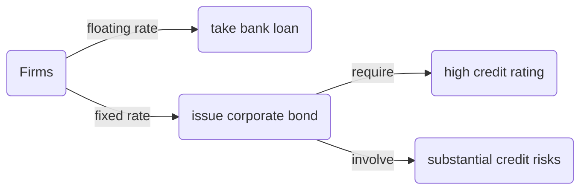
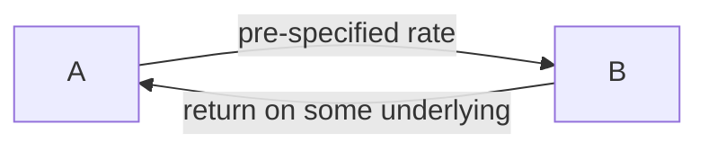

# Swaps
>[!Definition]
>A swap is an OTC agreement to exchange two streams of cash flows at pre-specified date or dates $T_{1}<\cdots<T_{m}$ until a terminal date $T$

Swaps are similar to [[L2 - Forward and Futures Contracts|forward contracts]]

|   |exchange timeline|hedge goal
|---|---|---|
|forward|asingle date|a single risky payment|
|swap|a period|a stream of risky payment|

Swaps save on transaction costs compared with a sequence of forward contracts.

## Swap Price
We can derive the swap price by [[L2 - Forward and Futures Contracts#Forward Price|replicating the portfolio]]
### Commodity Swap Example
An industrial producer needs to buy 100,000 barrels of oil one year from today and two years from today. The spot price $S_{0}=\$18.5$, and the 1-, 2-year interest rate today are $r_{0,1}=5.83\%$ and $r_{0,2}=6.3\%$

The forward prices are $F_{0,1}=S_{0}e^{r_{0,1}}\approx 20$ and $F_{0,2}=S_{0}e^{2\times r_{0,2}}\approx 21$

![[Pasted image 20251015224306.png]]
![[Pasted image 20251015224316.png]]

No arbitrage principle implies:

$$(20-x)e^{-r_{0,1}}+(21-x)e^{-r_{0,2}\times 2}=0$$

hence

$$x=20.483$$

### General Formula
Consider a swap with $m$ delivery dates, then no arbitrage implies that

$$\sum_{i=1}^m(F_{0,T_{i}}-x)e^{-r_{0,T_{i}}\times T_{i}}=0$$

Solving for $x$ we get

$$x=\frac{\sum_{i=1}^mF_{0,T_{i}}e^{-r_{0,T_{i}}\times T_{i}}}{\sum_{i=1}^{m}e^{-r_{0,T_{i}}\times T_{i}}}=\sum_{i=1}^{m}F_{0,T_{i}}\times w_{i}$$

i.e., the swap price $x$ is a **weighted average of forward prices**

where the *"weight"* $w_{i}$ is 

$$w_{i}=\frac{e^{-r_{0,T_{i}}\times T_{i}}}{\sum_{j=1}^{m}e^{-r_{0,T_{j}}\times T_{j}}}$$

### Value of Swaps
Similar to the [[L2 - Forward and Futures Contracts#Value of Forward Contract|value of forward contract]], we can derive the value of swaps by replicating portfolio.

The market value of a swap at $\tilde{t}\in(t_{0},t_{m})$ is the expected present value of the remaining payments on the original swap. The value of the new offset swap is zero.

![[Pasted image 20251016002928.png]]

The value of the original swap at $t=\tilde{t}$ is

$$(x_{\tilde{t}}-x)e^{-r_{\tilde{t},1}(t_{1}-\tilde{t})}+(x_{\tilde{t}}-x)e^{-r_{\tilde{t},2}(t_{2}-\tilde{t})}$$

## Interest Rate Swap
>[!Definition]
>An interest rate swap (“IRS”) is an OTC agreement in which two parties agree to exchange pre-specified fixed interest rate payments for floating interest rate payments, based on a pre-specified notional amount

- Long side:
	- the receiver of the floating rate payment
	- expect the floating rate to rise
- Short side: 
	- the payer of the floating rate payment
	- expect the floating rate to fall

- The notional principle of the swap: the notional amount based on which the interest payments are paid
- swap rate: the pre-specified fixed interest rate
- swap term/tenor: the maturity of the swap

### Uses of Interest Rate Swaps

#### Hedge

>[!Problem]
>an asset-liability mismatch in cash flow

>[!tip] Solution
>long an interest rate swap: pay fixed and receive floating

#### Synthetic Corporate Bonds

>[!Problem]
> A firm prefers a fixed over floating-rate loan

>[!tip] Solution
>
>1. Borrow using short term bank debt (floating rate)
>2. Long a rate swap

### Derive the Fixed Rate
We can derive the fixed rate in the interest rate swap by replicating it by two coupon bonds.

To offset the short position in rate swap

- receive fixed
	- sell a fixed rate bond
- pay floating
	- buy a floating rate bond

![[Pasted image 20251016015509.png]]

No arbitrage implies $B_{10,13}^\text{fix}=B_{10,13}^\text{float}$.

#### Price of Floating Rate Bond
Buy a 3-year floating rate bond with face value of $\$1$ $\iff$ Buy one-year bonds consecutively for 3 year

![[Pasted image 20251016020322.png]]

No arbitrage implies $B_{10,13}^\text{float}=\text{face value}=1$

#### Price of Fixed Rate Bond
$$B_{10,13}^\text{fix}=(e^R-1)e^{-r_{10,11}}+(e^R-1)e^{-r_{10,12}\times 2}+[(e^R-1)+1]e^{-r_{10,13}\times 3}$$

$R$ is the coupon rate such that $B_{10,13}^\text{fix}=B_{10,13}^\text{float}=1$. Thus,

$$e^R=\frac{1+e^{-r_{10,11}}+e^{-r_{10,12}\times 2}}{e^{-r_{10,11}}+e^{-r_{10,12}\times 2}+e^{-r_{10,13}\times 3}}$$

## Total Return Swaps
>[!Definition] 
>A swap agreement in which one party makes payments based on a given rate (fixed or variable), and the other party makes payments based on the return of some underlying asset.

- A insure the risky assets by a payment with known rate
- B claims the returns on the assets without having it in the balance sheet

## Volatility Swaps
>[!Definition]
>An agreement to exchange the volatility of some asset (for example, the S&P500) realized over some period for a pre-specified fixed volatility $K_{\text{vol}}$ Both volatilities are multiplied by a pre-specified notional amount $N$.

The payoff for the long side is

$$(\sigma_{\text{realized}}-K_{\text{vol}})\times N$$

- Speculative trading of volatility levels
- Trading the spread between realized and implied volatility levels
- Hedging implicit volatility exposure