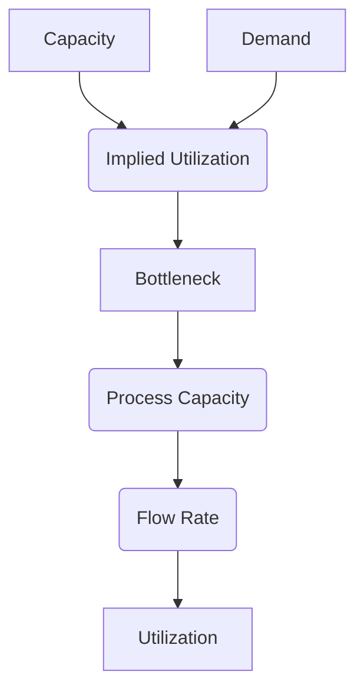

# Process Analysis
## A Process View
### Definition
A business process is a network of activities performed by resources that transform inputs into outputs.

The flow unit is what is tracked through the process and generally defines the process output of interest

![[Ust_Note/yr2_Fall/ISOM2700/attachments/Pasted image 20250918153002.png]]
### Process Flow Chart
![[Ust_Note/yr2_Fall/ISOM2700/attachments/Pasted image 20250918152851.png]]

## Process Measures
### Measures of Process Performance
- Flow Time
	- the time spent by a unit of product
	- time worked on + time in buffer
- Process Capacity
	- maximum rate at which output can be created given infinite inputs
	- i.e., the smallest capacity among all activities
	- i.e., the capacity of bottleneck
	- Capacity: units of output that can be produced per unit of time
- Cycle Time
	- the time between two successive product completions
	- $=\frac{1}{\text{Flow Rate}}$
- Work-in-Process Inventory
	- the number of units staying throughout the process at a given time
### Tool: Gantt Chart
#### Example
![[Ust_Note/yr2_Fall/ISOM2700/attachments/Pasted image 20250918154502.png]]

- Flow time: 10 min
- Process capacity: $\frac{1}{4}=0.25$ unit per min
	- worker B takes the longest time
- cycle time: 4 min
- average work-in-process inventory: $\frac{10}{4}=2.5$ units
##### Tighter Arrangement
![[Ust_Note/yr2_Fall/ISOM2700/attachments/Pasted image 20250918154928.png]]
> A worse scheduling with higher work-in-process inventory

Gantt chart does not work well for complex process
## Process Analysis
### Concept

- **Capacity**: The maximum amount a resource can produce in a given time period (e.g., 20 units/hour)
- **Demand**: The amount of output the market wants from the entire process (e.g., we have orders for 25 units/hour).
- **Implied Utilization:** A _calculation_ that shows the fraction of time a resource would need to work to _meet demand_ if it were the only constraint. It is **not limited to 100%**.

$$
\text{Implied Utilization}=\frac{\text{Demand Rate}}{\text{Capacity}}
$$

- **Bottleneck**: The resource with the highest implied utilization
	- If a resource has an implied utilization of 150%, it means that to meet demand, it would have to work at 150% of its capacity, which is impossible. It is clearly a constraint.\
	- not necessarily the resource with the lowest capacity
- **Process Capacity**: The capacity of the bottleneck resource
- **Flow Rate**: The actual rate at which the process produces finished units

$$\text{Flow Rate}=\min(\text{ Demand Rate},\text{ Process Capacity })$$

- **Utilization**: The fraction of time a resource is busy _actually producing output_ (e.g., 90% busy). This cannot exceed 100%.

$$\text{Utilization}=\frac{\text{Flow Rate}}{\text{Capacity}}$$

$$\text{Utilization}\leq \text{Implied Utilization}$$

### Law of the Minimum
Bottleneck: 

- determines the capacity of the entire process
- add up all the activities performed by each resource to compare

### Little's Law
$$L=\lambda \times W$$

$$\text{Work-in-process Inventory}=\text{Flow Rate}\times \text{Flow Time}$$

### Inventory Buffer
![[Ust_Note/yr2_Fall/ISOM2700/attachments/Pasted image 20250922231150.png]]

To reduce inventory buffer

- reduce the demand rate
- improve the process capacity

![[Ust_Note/yr2_Fall/ISOM2700/attachments/Pasted image 20250922231249.png]]

$$k=\begin{cases}
\text{Demand}-\text{Process Capacity}\quad (\text{Demand}>\text{Process Capacity})\\
-\text{Process Capacity}\quad (\text{Demand}<\text{Process Capacity})
\end{cases}$$