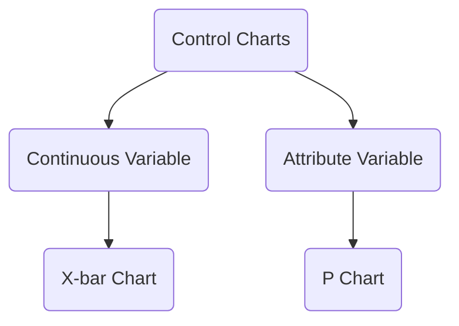

# Quality Management
## Process Control
### Types of Quality Variations
- Natural Variations
	- random errors, normal variability
	- inherent to the process
	- impact all output
	- cannot be eliminated without change in process itself
	- form a pattern that can be described as a distribution
- Assignable Variations
	- systematic errors, abnormal variability
	- specific "discoverable" cause
	- can be eliminated by management action
	- e.g., unskilled workers, poor material
### Implications
Only natural variations

- the process is in statistical control, forming a stable distribution, and therefore predictable
- Strategy: do nothing, leave it alone

Only assignable variations

- not stable and predictable
- Strategy: respond accordingly

Confusion between two types of variations leads to either over adjustment or missed improvement.

### Process Control Charts
- **Control limits** create the boundaries between **natural variations** and **assignable variations**.
- A **sample** is defined as a collection of units (observations) that are all produced under the same conditions.

![[attachments/Pasted image 20251031181324.png]]

#### X-bar Chart: for Continuous Variables
For product characteristic can be measured (e.g., weight, thickness), test for change in mean of distribution over time

![[attachments/Pasted image 20250923153234.png]]

$$A_{2}\times \bar{R}=3\times std(\{\bar{X}_{1},\bar{X}_{2},\dots,\bar{X}_{m}\})$$

![[attachments/Pasted image 20250923153249.png]]
![[attachments/Pasted image 20250923153317.png]]
![[attachments/Pasted image 20250923153342.png]]

#### P Chart: for Attribute Variables
For variables like yes or no, control the percentage of defective items

![[attachments/Pasted image 20250923153614.png]]

## Continuous Improvement
### Two Standard
- ISO 9000
	- Quality Management System
	- Quality-focused to meet customer expectation
- ISO 14000
	- Environmental Management System
	- Environment-focused to manage ecological footprint

### Specification Limits
Quality as defined by specification limits that defined by engineering designs

![[attachments/Pasted image 20250923155245.png]]

### Process Capability Index
$$C_{p}=\min\left( \frac{\bar{\bar{X}}-LSL}{3\hat{\sigma}},\frac{USL-\bar{\bar{X}}}{3\hat{\sigma}} \right)$$
It tells us the probability that a process will create a defect
 
![[attachments/Pasted image 20250923160040.png]]

### Six Sigma Quality
 It describes a level of quality where a process produces extremely few defects.
 
 ![[attachments/Pasted image 20250923183005.png]]
 
- $C_{p}\geq 1$ for three sigma quality 
- $C_{p}\geq 2$ for six sigma quality
- $C_{p}\geq 3$ for nine sigma quality
 
For multiple steps process, the effect will be magnified.

![[attachments/Pasted image 20250923183101.png]]

By reducing the standard deviation of the process, the process capacity $C_{p}$ will increase, i.e., a higher proportion of products can be produced within the specification limits.

## From Control to Improvement
![[attachments/Pasted image 20250923183325.png]]