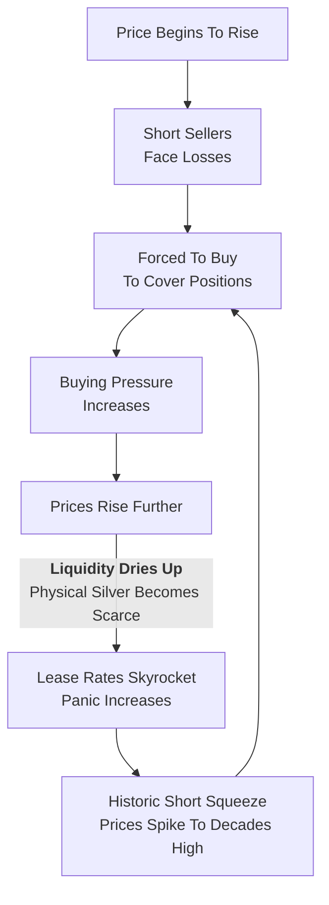

## The week ahead

Global policymakers and finance ministers are gathering in Washington for the International Monetary Fund and World Bank meetings. The danger of a market crash will be a major theme, with officials slated to speak throughout the week. US economic data may be impacted by government shutdown. Click [here for a full rundown](https://www.bloomberg.com/news/articles/2025-10-11/stock-bubble-dread-grips-central-bankers-in-washington).

**Monday**: Columbus Day in the US, bond markets closed. China trade data, India CPI, Nobel Prize for Economics announced in Stockholm, Fastenal earnings; Fed’s Paulson and BOE’s Mann speak at NABE

**Tuesday:** IMF releases its Global Financial Stability Report and World Economic Outlook; Fed’s Powell speaks at NABE; Singapore interest rate decision and GDP, Germany’s ZEW and CPI, UK jobless claims, Argentina inflation; Earnings from BlackRock, Domino’s Pizza, Johnson & Johnson, Wells Fargo, JPMorgan Chase, Goldman Sachs, Citigroup

**Wednesday:** Fed’s Beige Book, US empire manufacturing, China inflation, India trade, eurozone industrial production; Israel, France, Spain and Nigeria inflation; Earnings from Abbott Laboratories, Citizens Financial, PNC, Bank of America, Progressive, Morgan Stanley, JB Hunt, United Airlines, ASML; Fed’s Miran speaks at multiple events

**Thursday:** BOJ’s Tamura speaks, ECB’s Lagarde at IMF, UK industrial production; Israel GDP, Australia unemployment, Italy trade and CPI, Earnings from Bank of New York Mellon, US Bancorp, Charles Schwab, CSX

**Friday:** Eurozone CPI; BOJ’s Uchida speaks; Truist, Comerica, American Express, State Street, Ally Financial earnings

## Equity Market Overview
[S&P 500 futures bounced 1.4%](https://www.bloomberg.com/news/articles/2025-10-12/us-futures-jump-as-traders-gauge-china-trade-spat-markets-wrap) after President Donald Trump backpedaled on his tariff threats against Beijing, signaling a willingness to negotiate. Nasdaq 100 contracts rallied 2.3%. The softer tone [failed to ease fears in China](https://www.bloomberg.com/news/articles/2025-10-13/chinese-stocks-slide-as-renewed-trade-tensions-threaten-bull-run), where equities slumped and bond futures rose. US bond trading is shut for Columbus Day.

### TACO
Trump Always Chickens Out (TACO) is a term that gained prominence in May 2025 after many threats and reversals during the trade war U.S. President Donald Trump initiated with his administration's "Liberation Day" tariffs. The acronym is used to describe Trump's tendency to make tariff threats, only to later delay them as a way to increase time for negotiations and for markets to rebound. The term originated on Wall Street, where the TACO trade involves buying stocks cheaply after a tariff announcement pushes stocks lower, then selling them at a profit after the tariffs are delayed or reduced and the market rebounds.
## Silver Short Squeeze
Silver hit the highest level in decades as a historic short squeeze in London, where liquidity has almost entirely dried up. Some traders are even booking cargo slots on transatlantic flights for [bulky silver bars](https://www.bloomberg.com/news/articles/2025-10-11/silver-squeeze-evokes-hunt-brothers-as-banks-rush-bars-to-london) in an effort to profit off the massive difference between prices in London and New York. Gold surged to a fresh record.

Short Squeeze:

