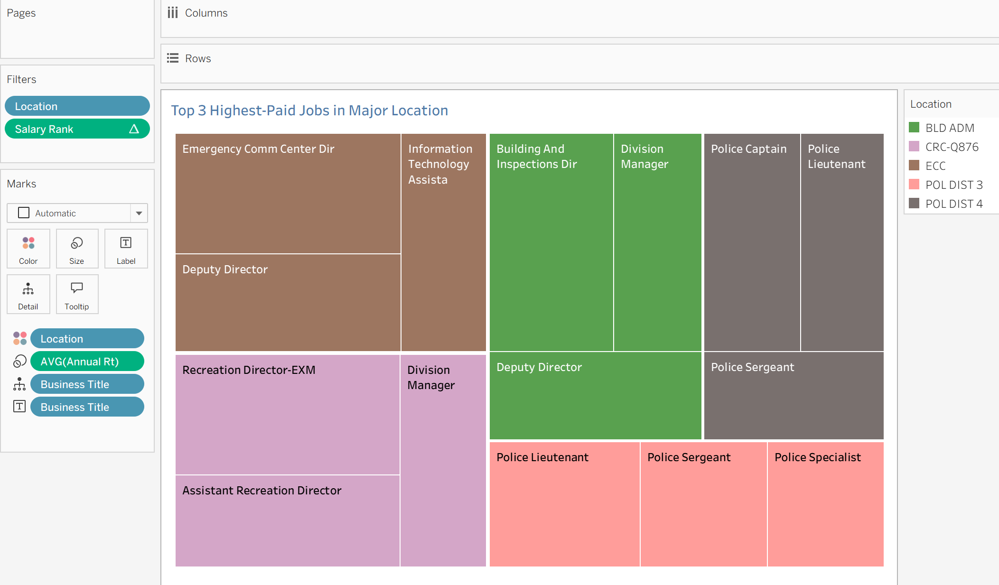
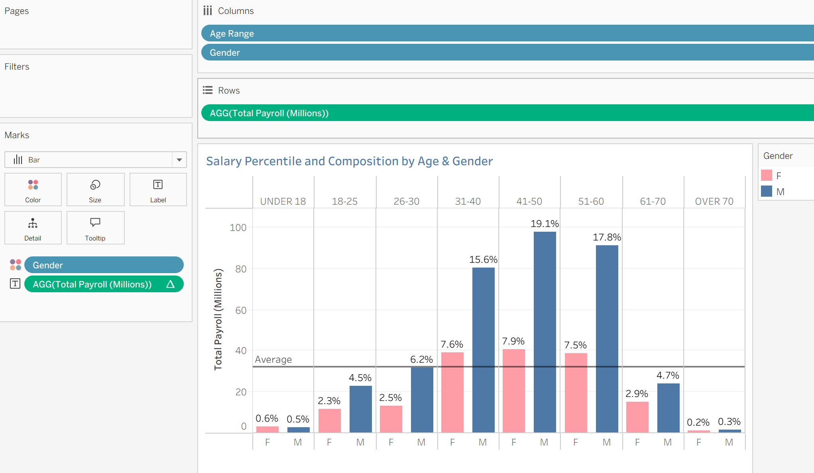
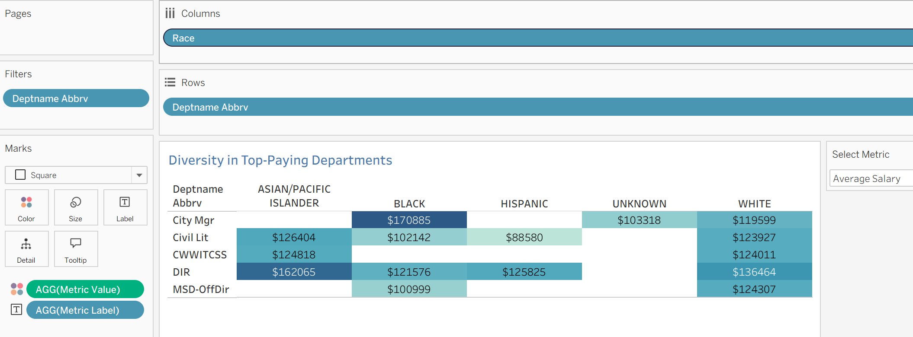
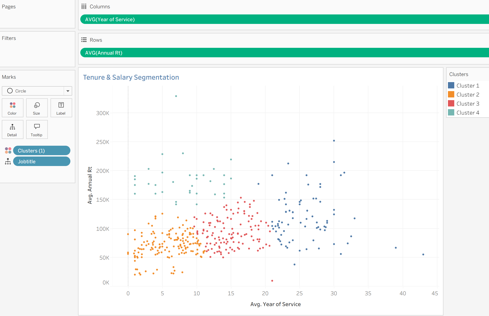

# Tableau Payroll Visual Analytics Dashboard

!!! info "Project Snapshot"
    - **Project Type:** Data Visualization and Visual Analytics (Tableau)
    - **Audience:** Recruiters, hiring managers, and analytics practitioners
    - **Core Goal:** Turn payroll and workforce data into actionable, decision-ready insights
    - **Tools:** Tableau, calculated fields, table calculations, parameters, clustering
    - **Dataset Source:** City of Cincinnati Open Data portal

## Live Dashboard

  <noscript>
    
  </noscript>
  <object class='tableauViz' style='display:none;'>
    <param name='host_url' value='https%3A%2F%2Fpublic.tableau.com%2F' />
    <param name='embed_code_version' value='3' />
    <param name='site_root' value='' />
    <param name='name' value='isom3330_project_2/CincinnatiWorkforceAnalyticsDashboard' />
    <param name='tabs' value='yes' />
    <param name='toolbar' value='yes' />
    <param name='static_image' value='https://public.tableau.com/static/images/is/isom3330_project_2/CincinnatiWorkforceAnalyticsDashboard/1.png' />
    <param name='animate_transition' value='yes' />
    <param name='display_static_image' value='yes' />
    <param name='display_spinner' value='yes' />
    <param name='display_overlay' value='yes' />
    <param name='display_count' value='yes' />
    <param name='language' value='en-US' />
  </object>

- Direct link: [Open on Tableau Public](https://public.tableau.com/views/isom3330_project_2/CincinnatiWorkforceAnalyticsDashboard?:language=en-US&:display_count=n&:origin=viz_share_link)

## Business Question

How can payroll, role structure, and diversity metrics be visualized so leaders can quickly identify pay concentration, demographic composition, and tenure-based role segmentation?

## Data Scope and Preparation

- Data level: employee payroll and workforce records, aggregated for dashboard views.
- Source dataset: [City of Cincinnati Employees w Salaries](https://data.cincinnati-oh.gov/Efficient-Service-Delivery/City-of-Cincinnati-Employees-w-Salaries/wmj4-ygbf/about_data)
- Key fields used: location, department, job title, age range, gender, race, annual salary, and `HIRE_DATE`.
- Data preparation highlights:
  - Standardized category labels for dimensions used in filters and grouping.
  - Built calculated fields for tenure and parameter-driven metric selection.
  - Applied analytical filters to focus on departments with meaningful representation.

!!! note "Data Provenance"
    Dashboard inputs are based on the official Cincinnati Open Data source linked above. Any filters, calculations, and aggregations shown in Tableau are transformations of that source dataset.

## Executive Insight Summary

- Compensation concentration is not evenly distributed across locations and roles.
- Payroll share by age and gender can diverge from headcount distribution, which is useful for equity review.
- Diversity interpretation changes depending on whether the metric is pay level or employee count, so parameter switching is essential.
- Tenure and salary clusters provide a compact view of workforce strata from entry-level to leadership roles.

## Dashboard Walkthrough

### Worksheet 1: Treemap - Top 3 Highest-Paid Jobs in Major Locations

- Top 5 city locations by **employee count**
- Within each location, top 3 job titles by **average annual salary**
- Box size encodes **average salary**
- Box color distinguishes **location**

**Decision support:** Quickly identifies where compensation is concentrated and which roles drive high payroll in each major location.

### Worksheet 2: Bar Chart - Salary Percentile and Composition by Age & Gender

- Total annual payroll (in millions) by **age range**
- Side-by-side bars split by **gender**
- **Reference line** for average payroll per age group
- **Table calculation (Percent of Total)** on labels to show each bar's share of total city payroll

**Decision support:** Reveals payroll composition across demographics and flags age-gender segments with outsized payroll share.

### Worksheet 3: Highlight Table - Diversity in Top-Paying Departments

- Heatmap crossing **department** (rows) and **race** (columns)
- Cell color intensity controlled by parameterized metric
- Parameter options:
  - **Average Salary**
  - **Median Salary**
  - **Employee Count**
- Filter logic:
  - Department employee count >= 5
  - Department is in top 5 by average salary

**Decision support:** Lets users switch analytical lens instantly and assess diversity profile in high-paying departments.

### Worksheet 4: Scatter Plot - Tenure and Salary Segmentation (Clusters)

- Each point represents a **job title**
- **X-axis:** Years of Service (calculated from `HIRE_DATE`)
- **Y-axis:** Annual Salary Rate
- Points colored by cluster:
  - Cluster 1: **Senior / Supervisory**
  - Cluster 2: **Entry-Level Roles**
  - Cluster 3: **Skilled / Mid-Career**
  - Cluster 4: **Executive / Leadership**

**Decision support:** Segments workforce roles by compensation and tenure profile for targeted workforce planning.

## Skills Demonstrated

- Translating business questions into dashboard-ready analytical views
- Building interactive Tableau components (parameters, table calculations, clustering)
- Designing visuals that balance readability and analytical depth
- Communicating findings for hiring, compensation, and workforce strategy decisions

## How to Interact

1. Use the location and demographic filters to narrow the analysis scope.
2. Switch the metric parameter in Worksheet 3 to compare salary vs. headcount patterns.
3. Hover points in Worksheet 4 to inspect cluster-level role characteristics.
4. Use the treemap and bar chart together to compare where payroll concentration and demographic composition align.

