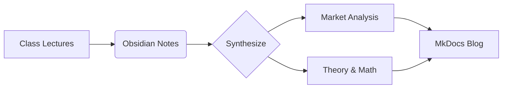

---
hide:
  - navigation
  - toc
---

# 🚀 Jermaine's Knowledge Hub

-   :material-chart-line:{ .lg .middle } __Market Insights__

    ---

    Daily digest of global market movements and financial news.

    [:octicons-arrow-right-24: View Market News](Market_News/Nov 6th.md)

-   :material-bank:{ .lg .middle } __Finance & Economics__

    ---

    Deep dives into Macroeconomics, Derivative Securities, and Corporate Finance.

    [:octicons-arrow-right-24: Explore 2025 Fall](ECON2123/Ch1&2 - Overview.md)

-   :material-factory:{ .lg .middle } __Operations & Management__

    ---

    Optimizing processes, quality control, and understanding organizational behavior.

    [:octicons-arrow-right-24: Operational Excellence](ISOM2700/Process_Analysis.md)

-   :material-lightbulb-on:{ .lg .middle } __Quick Reference__

    ---

    Condensed "Cheat Sheets" for high-stakes exam preparation and formulas.

    [:octicons-arrow-right-24: FINA3103 Cheat Sheet](FINA3103/Cheatsheet.md)

---

## 🎯 About This Blog

Welcome! I am **Chen Hejian (Jermaine)**. This space serves as my digital garden where I synthesize my studies at the intersection of **Finance** and **Operations**. 

Using a combination of [Obsidian](https://obsidian.md) for note-taking and [MkDocs](https://www.mkdocs.org) for publishing, I aim to create a structured, searchable, and mathematically rigorous knowledge base.

### 🛠️ Study Framework

[Image of knowledge management workflow]

---

## ⚡ Quick Links

| Category | Primary Focus | Status |
| --- | --- | --- |
| **ECON2123** | Macroeconomic Models (IS-LM, AS-AD) | 🟢 Active |
| **FINA3203** | Derivatives, Forwards & Swaps | 🟡 In Progress |
| **ISOM2700** | Supply Chain & Inventory | 🟢 Active |
| **Cheat Sheets** | Formulas & Exam Prep | 🔥 High Priority |

---

!!! danger "Don't click me"
I warned you... but since you're here, you might as well check out the [secret section](Don't click me.md).

&nbsp;

